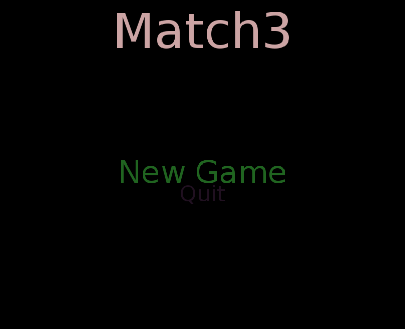

# Match3 Game using Cocos2d

Fruits art from http://dycha.net, distributed under CC-BY 3.0
  http://opengameart.org/content/platformer-food-pack

## Running the game:
```sh
# Get the source
git clone https://github.com/joaompinto/Match3-Cocos2d
cd Match3-Cocos2d
# Install the required libs
sudo pip install requirements.txt
# Start the game
python match3cocos2d/Main.py
```



